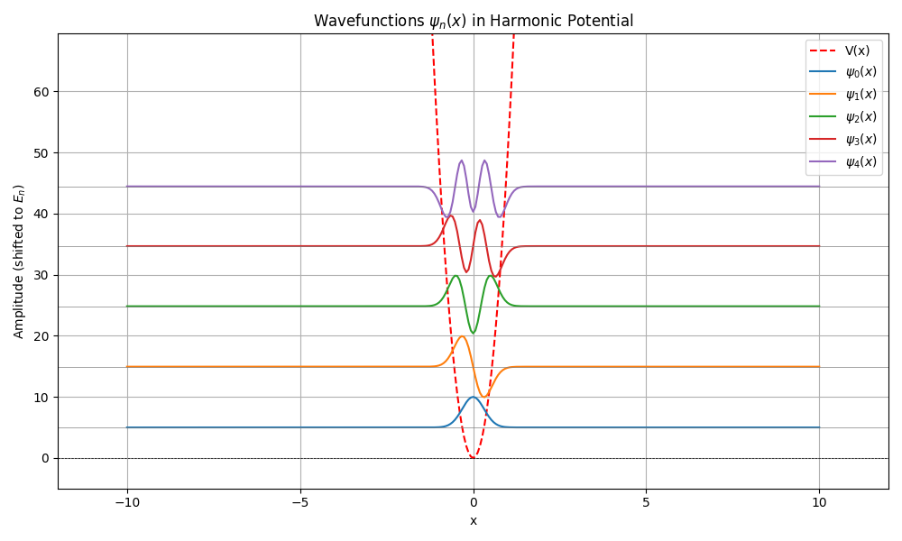
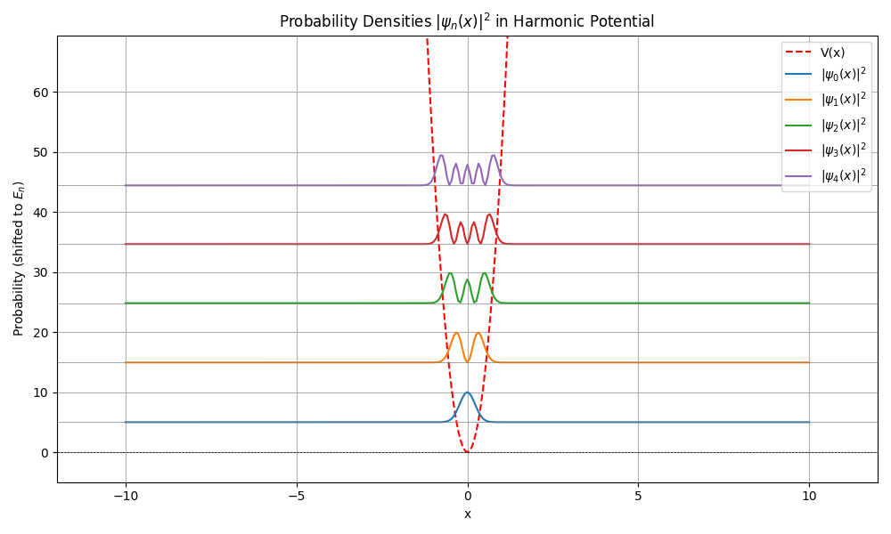
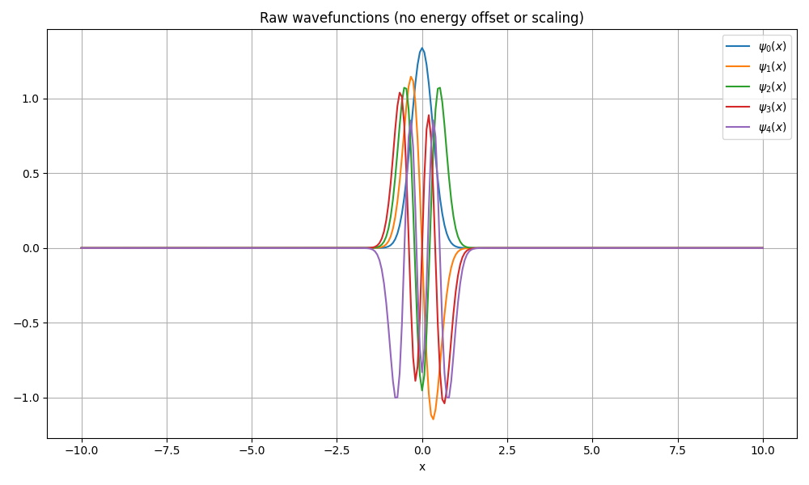

# Schrodinger Equation Solver – PHYS 4840 Final Project

## Overview

This project develops a software tool (usable from the terminal) written primarily in Fortran to numerically solve the one-dimensional time-independent Schrodinger equation using finite difference methods. The user provides simulation parameters via an input file, including the spatial domain, grid resolution, number of eigenstates to compute, and a potential type such as the quantum harmonic oscillator (potential types are specified in the code and selected numerically, e.g., 1 for harmonic oscillator, 2 for infinite square well, etc.). The program constructs the Hamiltonian matrix manually from the finite-difference Laplacian and the user-defined potential, then solves the resulting eigenvalue problem using a fully implemented Jacobi diagonalization algorithm—without relying on built-in diagonalizers. The output includes normalized eigenfunctions and their corresponding energy eigenvalues saved to text files. A separate Python script reads these outputs and generates plots of both the real-valued wavefunctions $\psi_n(x)$ and the probability densities $|\psi_n(x)|^2$, each overlaid with the input potential function $V(x)$ for visual comparison. All code is modularized, well-documented below, and runs entirely from the command line. 

## Features

- Solves the 1D time-independent Schrodinger equation
- User-defined potential options:
  - Harmonic oscillator
  - Infinite square well
  - Finite square well
  - Step Potential
  - Step trap Potential
  - Step Barrier Potential
  - (Others can be added numerically)
- Finite difference approximation for the second derivative
- Jacobi diagonalization (implemented from scratch, not imported)
- Outputs:
  - Normalized eigenfunctions $\psi(x)$
  - Corresponding energy eigenvalues
  - All results saved to plain text files
- Python script to plot:
  - Real-valued wavefunctions $\psi(x)$
  - Probability densities $|\psi(x)|^2$
  - Input potential $V(x)$
- Command-line interface with customizable input file
- Fully modular and documented Fortran codebase
- Includes `Makefile`, test case, and plotting script

## Methods

We numerically solve the time-independent Schrodinger equation:

$$
\left[ -\frac{\hbar^2}{2m} \frac{d^2}{dx^2} + V(x) \right] \psi(x) = E \psi(x)
$$

Discretization is performed using the second-order central finite difference approximation:

$$
\frac{d^2 \psi}{dx^2} \approx \frac{\psi_{i+1} - 2\psi_i + \psi_{i-1}}{\Delta x^2}
$$

This leads to a matrix eigenvalue problem:

$$
H \psi = E \psi
$$

Where $H$ is the Hamiltonian matrix, assembled from the kinetic energy (Laplacian) and the user-defined potential.

## Numerical Techniques

- **Finite Difference Method (FDM)**: for discretizing the Laplacian
- **Jacobi Method**: for symmetric matrix diagonalization
- **Rectangular approximation**: for normalizing eigenfunctions

## Languages Used

- **Fortran**: all numerical computation and simulation
- **Python**: for reading output and plotting results

## Modules & Code Structure

### `potential_functions.f90`

This module defines a suite of potential energy functions used in constructing the Hamiltonian matrix for solving the Schrödinger equation. It supports both standard and custom quantum potentials, each implemented as a Fortran function that returns the scalar potential value at a given position `x`. All functions are written with double precision (`real(8)`).

#### Implemented Potentials:

- **Harmonic Oscillator (`harmonic_oscillator`)**  
  Returns $V(x) = \frac{1}{2} m \omega^2 x^2$ using default parameters $m = 1$, $\omega = 1$. This is a classic quantum mechanical potential with analytically known eigenvalues for comparison.

- **Infinite Square Well (`infinite_square_well`)**  
  Models a box of width $x_{\text{max}} - 1 to x_{\text{min}} + 1$ with infinite potential outside the domain. Returns a large constant (`1.0d20`) when $x$ is outside the bounds, and zero within.

- **Finite Square Well (`finite_square_well`)**  
  Similar to the infinite well, but allows the user to specify a finite barrier height `V0`. Inside the well ($x_{\text{min}} + 2 < x < x_{\text{max}} - 2$), the potential is zero; outside, it is set to `V0`.

- **Step Potential (`step_potential`)**  
  A simple step function: returns `0` for $x < 0$, and `5` for $x \geq 0$. Useful for testing quantum tunneling and reflection behavior.

- **Stepped Trap (`stepped_trap`)**  
  A compound potential that acts as a trap:
  - $V(x) = 0$ for $x < 0$
  - $V(x) = 5$ for $0 \leq x < 3$
  - $V(x) = 10^6$ for $x \geq 3$  
  This potential mimics a semi-infinite step followed by a hard wall to create confinement.

- **Step Barrier (`step_barrier`)**  
  A localized barrier in the middle of the domain:
  - $V(x) = 0$ for $x < 0$
  - $V(x) = 5$ for $0 \leq x \leq 5$
  - $V(x) = 0$ for $x > 5$  
  This potential models a finite-width barrier (height = 5 units, width = 5 units) and is useful for testing partial transmission and tunneling effects.


Each function is pure and independent, enabling easy extension of the module to support additional potentials. These functions are called in the main solver to construct the potential energy term $V(x_i)$ at each grid point.

> **Disclaimer on Potentials 4–6**:  
> The Step Potential, Stepped Trap, and Step Barrier are included as test cases to explore non-smooth or discontinuous potentials. However, these are **simplified models** and may not fully reproduce the exact boundary behavior expected in quantum mechanical systems, especially in finite domains. For example, reflection and transmission in the step potential or tunneling in the step barrier may not align exactly with textbook expectations due to domain truncation, numerical resolution, and hard cutoff approximations (e.g., using large but finite wall values like `1e6`). These are useful for qualitative insight but should not be considered quantitatively exact.


### `matrix_tools.f90`

This module implements the **Jacobi diagonalization method** for symmetric matrices, specifically tailored to solving the eigenvalue problem for the discretized Hamiltonian matrix in the 1D time-independent Schrödinger equation.

#### Subroutine: `jacobi`

This is a complete, from-scratch implementation of the classical **Jacobi eigenvalue algorithm**, designed to diagonalize real symmetric matrices without using external libraries (in compliance with project guidelines).

##### Inputs:
- `A(n,n)`: the symmetric matrix to be diagonalized (modified in-place)
- `n`: dimension of the matrix
- `max_iter`: maximum allowed iterations
- `tol`: convergence tolerance for the off-diagonal norm

##### Outputs:
- `eigvals(n)`: computed eigenvalues, extracted from the diagonal of the converged matrix
- `eigvecs(n,n)`: corresponding eigenvectors, initialized as the identity and updated through successive rotations

##### Key Features:
- **Manual selection of pivot elements**: finds the largest off-diagonal term for each rotation step.
- **Orthogonal rotations**: uses a numerically stable formulation for the rotation angle to avoid overflow or precision issues.
- **Frobenius norm check**: monitors the sum of squares of off-diagonal elements to check convergence.
> A small Frobenius norm of the off-diagonal elements indicates that these elements are approaching zero, meaning the matrix `A` is becoming increasingly diagonal. The diagonal elements of a diagonal matrix are its eigenvalues.
- **Symmetry enforcement**: updates both rows and columns during rotation to maintain symmetry.
- **Eigenvector accumulation**: rotates the identity matrix alongside `A` to accumulate eigenvectors.
- **Diagnostic output**: optional print statement every 500 iterations for tracking convergence progress.

##### Behavior:
- If the algorithm does not converge within `max_iter` iterations, a warning is printed.
- Upon convergence, eigenvalues are returned in `eigvals` and corresponding normalized eigenvectors in `eigvecs`.

This module is core to solving the Schrödinger equation numerically, as it enables the diagonalization of the Hamiltonian matrix constructed from finite difference methods.

### `normalization.f90`

This module provides a routine to **normalize the computed wavefunctions** so that each satisfies the quantum mechanical condition:

$$
\int |\psi_n(x)|^2 \, dx = 1
$$

#### Subroutine: `normalize_wavefunctions`

This subroutine performs normalization on a 2D array of wavefunctions, where each row corresponds to a different eigenstate and each column corresponds to a point on the spatial grid.

##### Inputs:
- `psi(:,:)`: matrix of real-valued wavefunctions (shape: `nstates × Nx`), passed as `intent(inout)`
- `dx`: spatial grid spacing

##### Behavior:
- For each wavefunction $\psi_n(x)$:
  - The L2 norm is computed using the rectangular (midpoint) rule:

    $$
    \\mathrm{norm} = \\displaystyle\\sqrt{\\sum_i \\psi_n(x_i)^2 \\cdot \\Delta x}
    $$


  - The wavefunction is then rescaled:

    $$
    \\psi_n(x_i) \\leftarrow \\displaystyle\\frac{\\psi_n(x_i)}{\\mathrm{norm}}
    $$


This ensures each wavefunction is properly normalized before plotting or analysis. The procedure is numerically stable, uses vectorized Fortran operations, and works for any number of computed states.


This subroutine should be called after diagonalizing the Hamiltonian but before writing the wavefunctions to file.
### `main_solver.f90`

This is the main driver program for solving the **one-dimensional time-independent Schrödinger equation** using the finite difference method. It integrates all modules (`potential_functions`, `matrix_tools`, and `normalization`) and handles input parsing, grid and Hamiltonian construction, matrix diagonalization, normalization, and output.

#### Major Responsibilities:

- **Input Parsing**:  
  Reads simulation parameters from an external input file (`input.txt`), ignoring blank lines and comment lines beginning with `!`. Parameters include:
  - Spatial domain: `xmin`, `xmax`, number of points `Nx`
  - Potential type (integer identifier)
  - Number of eigenstates to compute
  - Optional potential depth `V0` (used only for the finite square well)

- **Grid & Potential Construction**:  
  Initializes a spatial grid of `Nx` points and computes the potential $V(x)$ at each grid point based on the selected potential type. Custom potentials are centered within the domain using predefined mappings.

- **Hamiltonian Assembly**:  
  Constructs the symmetric tridiagonal Hamiltonian matrix $H$ using:
  $$
  H_{ii} = \frac{1}{\Delta x^2} + V(x_i), \quad
  H_{i,i\pm1} = -\frac{1}{2\Delta x^2}
  $$
  This corresponds to a second-order central finite-difference approximation of the kinetic energy operator plus the diagonal potential.

- **Eigenvalue Problem Solution**:
  - Calls `jacobi` to diagonalize the Hamiltonian matrix
  - Calls `sort_eigenpairs` to sort eigenvalues and their corresponding eigenvectors in ascending energy order
  - Calls `normalize_wavefunctions` to normalize each eigenfunction using the L² norm

- **Output Files**:
  - `xgrid.txt`: spatial grid points
  - `eigenvalues.txt`: lowest `nstates` eigenvalues (energies)
  - `wavefunctions.txt`: corresponding normalized eigenfunctions (each column is a state)
  - `H_sample.txt`: optional debugging output showing the top-left 10×10 block of the Hamiltonian matrix

- **Internal Procedure: `sort_eigenpairs`**  
  Sorts eigenvalues and corresponding eigenvectors using a basic selection sort algorithm to ensure energy levels are ordered from lowest to highest.

This program serves as the computational 'backbone' of the solver, linking together all physical modeling and numerical components into a single executable workflow.
### `plot_results.py`

This Python script visualizes the numerical results computed by the Fortran solver. It reads the output files (`xgrid.txt`, `eigenvalues.txt`, and `wavefunctions.txt`) and produces plots of the wavefunctions, probability densities, and input potential. All plots are saved in a `plots/` directory.

#### Responsibilities:

- **Input Parsing**:
  - Reads `input.txt` to determine spatial domain, number of grid points, number of eigenstates, and potential type.
  - Automatically handles comment lines (`!`) and blank lines.

- **Data Loading**:
  - Loads the spatial grid, computed eigenvalues, and eigenfunctions from Fortran-generated text files.
  - Transposes wavefunction data if needed to ensure shape is `(nstates, Nx)`.

- **Potential Evaluation**:
  - Reconstructs the potential function $V(x)$ on the same grid using a Python equivalent of the Fortran logic.
  - Supports the following potential types:
    - `1`: Harmonic oscillator
    - `2`: Infinite square well
    - `3`: Finite square well
    - `4`: Step potential
    - `5`: Stepped trap potential
    - `6`: Stepped barrier potential

- **Plot Generation**:
  - **Raw Wavefunctions**:  
    - Plots each $\psi_n(x)$ directly without any energy offset or scaling.
    - Useful for diagnostics and sanity checking.
    - Saved as: `plots/raw_wavefunctions.png`
  
  - **Wavefunctions overlaid with $V(x)$ and $E_n$**:  
    - Plots $\psi_n(x)$ vertically shifted by their corresponding eigenvalues for better visual alignment.
    - Includes the potential curve $V(x)$ and horizontal lines at each $E_n$.
    - Saved as: `plots/wavefunctions.png`
  
  - **Probability Densities**:  
    - Plots $|\psi_n(x)|^2$ shifted by $E_n$ to show spatial localization and tunneling.
    - Also includes $V(x)$ and energy levels.
    - Saved as: `plots/probability_densities.png`

#### Notes:

- Uses `numpy` and `matplotlib` (only standard scientific Python packages).
- Output is automatically organized in the `plots/` directory.
- The script ensures robust formatting, axis labeling, legends, and titles — all dynamically adjusted based on input.

This script provides an essential post-processing step to analyze the quantum mechanical behavior of each eigenstate and the influence of the potential landscape.
### `Makefile`

This `Makefile` automates the build and execution process for the Schrödinger equation solver. It compiles the Fortran modules and main program, links them into a single executable, and optionally runs the entire workflow including the Python visualization script.

#### Key Targets:

- **`all` (default)**  
  Compiles all Fortran source files and links them into an executable named `schrodinger_solver`. This includes:
  - `potential_functions.f90`
  - `matrix_tools.f90`
  - `normalization.f90`
  - `main_solver.f90`

- **`run`**  
  Executes the compiled solver and immediately runs the Python script for plotting:
  ```sh
  ./schrodinger_solver
  python3 plot_results.py
  ```

- **`clean`**  
  Removes build artifacts and generated files:
  - Deletes the Fortran executable, `.o` object files, and `.mod` module files
  - Deletes the Python `__pycache__` folder
  - Deletes the `plots/` directory containing saved figures

#### Compiler Configuration:

- Uses `gfortran` as the Fortran compiler.
- Sets standard flags:
  - `-O2`: moderate optimization
  - `-Wall`: enable all warnings for safer debugging

This Makefile streamlines reproducibility, ensuring all code can be compiled and run with a single command.


## Input File Format

The program reads simulation parameters from an input file named `input.txt`. The input file should follow the structure shown below, with comment lines (starting with `!`) describing each field:

```txt
! xmin xmax Nx
-5 5 3000

! potential_type
1

! num_eigenstates
4

! V0 (only used if potential_type == 3)
100.0
```

### Field Descriptions

- **xmin, xmax, Nx**:  
  Define the spatial domain of the simulation.  
  - `xmin`: minimum x-value  
  - `xmax`: maximum x-value  
  - `Nx`: number of spatial grid points

- **potential_type**:  
  Integer that selects the potential used in the simulation.  
  - `1`: Harmonic oscillator  
  - `2`: Infinite square well  
  - `3`: Finite square well (uses `V0`)

- **num_eigenstates**:  
  Number of lowest-energy eigenstates to compute and output.

- **V0**:  
  Depth of the finite square well (only used if `potential_type == 3`).

### Notes

- Comment lines starting with `!` are ignored by the program.
- The input file must not contain blank lines between parameters.
- All values are space-delimited.

Make sure your input file is saved as `input.txt` in the working directory when running the solver.

## Constraints and Supported Inputs

The current version expects `input.txt` to follow a strict format (comment lines beginning with `!` are allowed and ignored). When altering the input file only change the numbers (not their location or adding and taking out any spaces or lines in the file), as other modifications to the input file have not been tested. The constraints for each input field are:

- **xmin, xmax**:
  - Floating-point numbers
  - Must satisfy `xmax > xmin`
  - Has been tests for `xmax: 5-10` and `xmin: -5 - -10`
- **Nx**:
  - Positive integer
  - Must be ≥ 100 (recommended: ≥ 500 for accurate results)
  - Increaseing Nx will increase computation time
  - Minimum Nx value of 200 recommended
  - Has not been tested for Nx values over 500
- **potential_type**:
  - `1` = Harmonic Oscillator (`V(x) = x²`)
  - `2` = Infinite Square Well
  - `3` = Finite Square Well (requires `V0` to be specified on the `input.txt` file)
  - `4` = Step Potential
  - `5` = Stepped Trap Potential
  - `6` = Stepped Barrier Potential
- **num_eigenstates**:
  - Positive integer
  - Must be ≤ `Nx`
  - Has been tested for values 1 - 15
  - Inputting greater than 15 can cause the plots to become overly cluttered
- **V0**:
  - Required **only if** `potential_type == 3`
  - Must be a positive floating-point number
  - Values from 10-100 have been tested

> **Note**: The program does not currently validate user input, so malformed or missing entries in `input.txt` may result in runtime errors. Future versions will include error checking and improved flexibility.

### Example Valid Input

```text
! xmin xmax Nx
-10 10 305

! potential_type
1

! num_eigenstates
5

! V0 (ignored unless potential_type = 3)
0.0
```

### Output

The solver generates:

- `xgrid.txt`: spatial grid
- `eigenvalues.txt`: energy levels
- `wavefunctions.txt`: eigenfunctions
- Plots of $\psi(x)$, $|\psi(x)|^2$, and $V(x)$ saved to the `plots/` directory

## Example Output

Here is an example plot of computed wavefunctions overlaid with the potential $V(x)$ and energy levels $E_n$ using the above "Example Valid Input":

### 1. Wavefunctions overlaid with Potential and Energy Levels


### 2. Probability Densities overlaid with Potential and Energy Levels


### 3. Raw Wavefunctions (Unscaled)



## Running the Code

1. Clone the repository
2. Edit `input.txt` to set parameters (grid, potential, number of states, etc.)
3. Run `make` to compile
4. Execute `make run` to run the solver and generate plots
5. Executre `make clean` to clean the directory for a new run

## Installation & Build

### 1. Clone the repository

```bash
git clone https://github.com/NIKIVLASTOS/PHYS4840.git
```
### 2. Navigate to the directory

```bash
cd PHYS4840/PROJECT
```
### 3.  Install Python dependencies
```bash
pip install numpy matplotlib
```
### 4. Edit input file
Open the input file
```bash
vi input.txt
```
edit file as desired then save and exit:

```bash
:wq
```
### 5.  Compile the solver
Use the provided `makefile` to compile the Fortran source:
```bash
make
```
### 6. Run the simulation and generate plots
```bash
make run
```


## Future Goals

- Upload the package to PyPI
- Add more potential options (e.g., double-well)
- Optimize diagonalization for larger systems

## Tested Systems

This project has been tested and verified to compile and run successfully on the following systems:

- **macOS 10.15+** with `gfortran` (Homebrew), Python 3.13.1, numpy 1.26.1, matplotlib 3.9.4
- **Wyoming ARCC (Medicine Bow)** HPC cluster using GNU compiler suite and Python 3.9.21, numpy 1.26.4, matplotlib 3.9.4 

Compilation is managed via a standard `Makefile`. Python dependencies are minimal (NumPy and Matplotlib). No proprietary or platform-specific libraries are required.

(CONSIDER LEAVING) If you encounter platform-specific issues, please open an issue on the GitHub repository.

